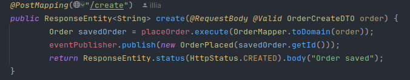

# E-commerce Project Documentation

## Project Description
This e-commerce project is a backend application designed using Domain-Driven Design (DDD) principles and Clean Architecture.

Key features of the project include:
- Modular design with independent domains.
- Event-driven communication for scalability and decoupling.
- Clean Architecture with clear separation of concerns.
- Easily extendable and replaceable components for domain events.

This document provides an overview of the system's architecture, installation process, and workflow details.

## Table of Contents
1. [Installation](#1-installation)
2. [Architecture Overview](#2-architecture-overview)
3. [Project Structure](#3-project-structure)
4. [Main Workflow: Order Creation](#4-main-workflow-order-creation)
5. [Demonstration](#5-demonstration)
6. [Future Enhancements](#6-future-enhancements)

---

## 1. Installation

### Requirements

- Java 17+
- Maven 3.8+

### Steps

1. Clone the repository:
   ```bash
   git clone https://github.com/Black1955/E-Commerce.git
   ```
2. Navigate to the project directory:
   ```bash
   cd E-Commerce
   ```
3. Configure database settings in `application.properties`:
   ```properties
   spring.datasource.url=jdbc:postgresql://localhost:5432/ecommerce
   spring.datasource.username=your_username
   spring.datasource.password=your_password
   ```
4. Build and run the application:
   ```bash
   mvn clean install
   mvn spring-boot:run
   ```

---

## 2. Architecture Overview

### Domain-Driven Design (DDD) and Clean Architecture

The project follows Domain-Driven Design principles combined with Clean Architecture. The main goal is to ensure clear separation of concerns and high maintainability.

### Key Design Principles

1. **Isolated Contexts**: Each domain is independent and has its own responsibilities.
   

   **For creating some Value Objects (VO) such as IDs, there is an additional context called Shared Kernel.**
   

2. **Layered Architecture**: Each context follows a three-layer structure:
   - 

      The main idea is to maximize the isolation of business logic from external libraries. The entire core can function with any database and any framework because all dependencies are built on abstractions rather than implementations.

    - **Core**: Contains domain entities, aggregates, repositories, and use cases.
      
      

      Here, you can see that we have an interface for the Order repository, but we don’t have its implementation. In the UseCase, we use Dependency Injection to inject a repository. This eliminates direct dependency and makes it easy to change the database implementation.

    - **Data**: Responsible for database interactions (e.g., Spring Data JPA).
      In the Data layer, we create implementations of repositories. This could involve any database or other tools, even text files.
      

    - **Presenters**: Handles REST endpoints and event handling.
      REST handlers use the UseCases to perform actions, such as saving.
      

3. **Event-Driven Communication**: Domains communicate through domain events, implementing the **Saga** pattern with choreography.

   Communication between contexts is implemented using events. Each context publishes an event upon completing an action, and another context listens to these events and performs specific actions. To implement this mechanism, I created a `DomainEvent` interface and an `EventPublisher` interface in the domain layer, with a single method for publishing events. At the presenter level, I "wired" the implementation of this interface using `ApplicationEventPublisher`. The entire process of event propagation is now managed by Spring.

   

### Core Abstractions

- **DomainEvent**: Interface representing a domain event.
- **EventPublisher**: Interface for publishing domain events. Spring's application context is used for implementation, allowing easy replacement with other tools.

---

## 3. Project Structure

```
📂 ecommerce-project
├── 📂 order
│   ├── 📂 core
│   │   ├── 📂 domain
│   │   ├── 📂 repositories
│   │   └── 📂 usecases
│   ├── 📂 data
│   │   ├── 📂 jpa
│   │   ├── 📂 implementations
│   │   ├── 📂 entities
│   │   └── 📂 mappers
│   └── 📂 presenters
│       ├── 📂 rest
│       ├── 📂 handlers
│       └── 📂 configs
├── 📂 delivery
│   └── (similar structure as order)
├── 📂 inventory
│   └── (similar structure as order)
├── 📂 payment
│   └── (similar structure as order)
├── 📂 catalog
│   └── (similar structure as order)
└── 📂 shared
    └── 📂 events
```

---

## 4. Main Workflow: Order Creation

### Overview

1. **Order Creation**: When an order is created, it emits an event for inventory validation.
2. **Inventory Validation**: Inventory checks the availability, deducts items, and emits an event upon success.
3. **Payment Processing**: Payment context registers and processes the payment, emitting a success event.
4. **Delivery Scheduling**: Delivery context retrieves the shipping address and schedules the delivery.


### Detailed Steps

#### Step 1: Order Creation

- **Event Emitted**: `OrderCreated`


#### Step 2: Inventory Validation

- **Event Handled**: `OrderCreatedEvent`
- **Event Emitted**: `FetchOrderData`
- **Event Handled**: `OrderDataForInventoryFetched`
- **Event Emitted**: `StockCheckedAndReserved`


#### Step 3: Payment Processing

- **Event Handled**: `StockCheckedAndReserved`
- **Event Emitted**: `FetchDataPayment`
- **Event Handled**: `OrderDataForPaymentFetched`
- **Event Emitted**: `PaymentCreated`

#### Step 4: Delivery Scheduling

- **Event Handled**: `PaymentCreated`
- **Event Emitted**: `FetchDataDelivery`
- **Event Handled**: `OrderDataForDeliveryFetched`
- **Action**: Retrieve shipping address, save delivery aggregate.

---

## 5. Demonstration

### API Endpoints

- **Product Creation**:
  ```json
  POST /product/create
  {
      "title": "macbook air m1",
      "description": "macbook air m1 with 256gb and 16gb RAM",
      "price": 600.0,
      "categories": [
          {
              "id": "computers",
              "name": "computers"
          }
      ]
  }
  ```
- **Category Creation**:
  ```json
  POST /category/create
  {
      "name": "computers"
  }
  ```
- **Add Inventory Stock**:
  ```json
  POST /inventory/add
  {
      "productId": "12345",
      "quantity": 50
  }
  ```
- **Order Creation**:
  ```json
  POST /order/create
  {
      "userId": "12345",
      "address": {
          "street": "street123",
          "city": "Bielefeld",
          "ZIP": "12345",
          "country": "Germany"
      },
      "orderItems": [
          {
              "id": "12345",
              "quantity": 9
          }
      ],
      "price": 150.75,
      "paymentDetails": {
          "cardNumber": "1234123412341234",
          "CVV": "123",
          "expirationDate": "12/34"
      }
  }
  ```
  
### Example Workflow

 - 
 - 
 - 

---

## 6. Future Enhancements

1. Replace Spring Context for event publishing with Kafka or RabbitMQ for distributed microservices.
2. Implement monitoring and tracing for better observability of events.
3. Add integration tests for complete workflow validation.
4. add frontend

